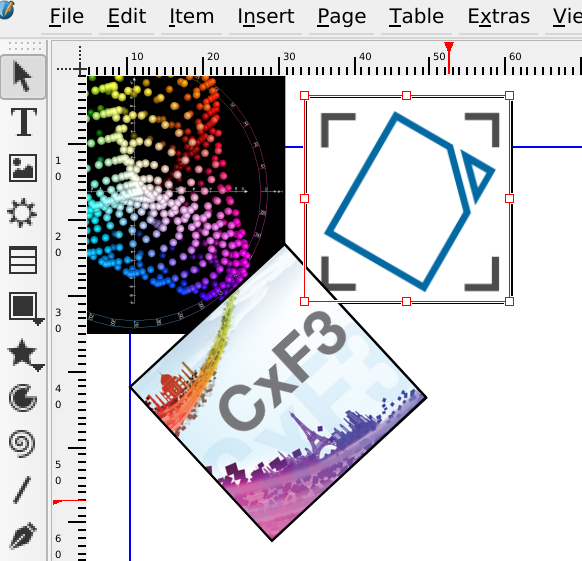

## Scribus 1.5.4 Released

Scribus 1.5.4 has been released with quite a few improvements in the color handling (64 bit internal representation, CxF3 support, import LAB colors) and a new import filter for QuarkXPress 4 and 5 documents (thanks to the Document Liberation Project).

===

See the [full release notes](https://wiki.scribus.net/canvas/1.5.4_Release) in the [Scribus Wiki](https://wiki.scribus.net/).
