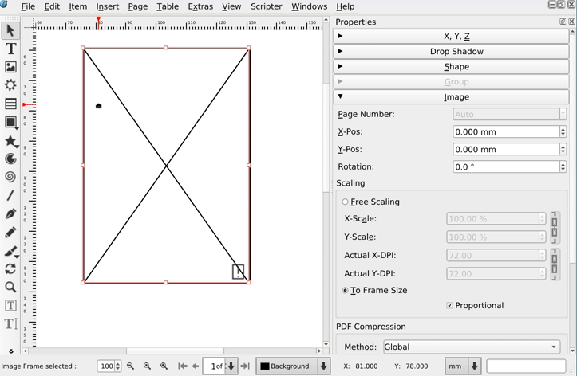
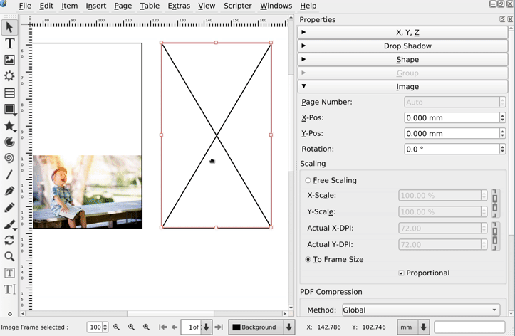
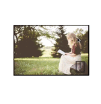
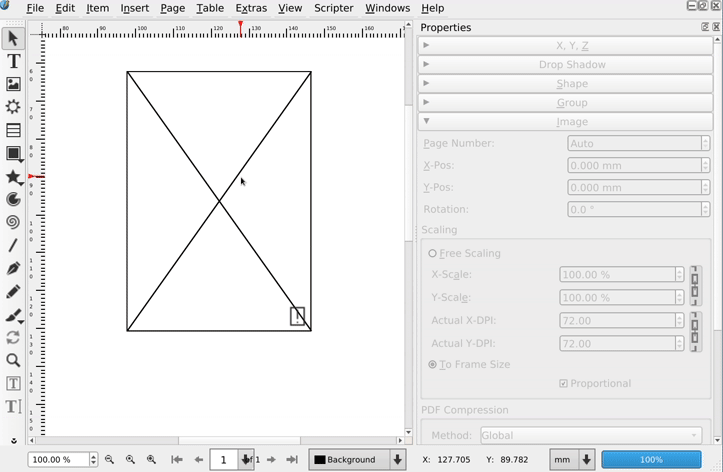
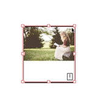
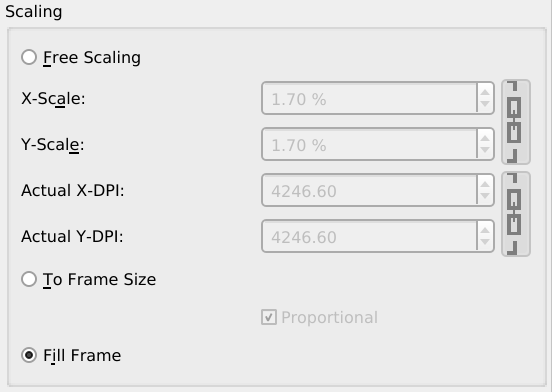

## Fitting images and filling frames

Scribus can resize image frames to their content, but if you want things to be correctly aligned it won't assist you as much as it could. I've submitted ~~two~~ one patche~~s~~ for making it easier to fit an image in a frame or to to fill it.

===

Since forever, you have been able to choose two scaling modes for images: free and to frame size scaling. On top of it, you  have had the context menu, to resize the frame to its content.

That's really handy!

But, if you further move the image inside of the frame, it's hard to get _exact_ results:

On top of it, I still can't figure a use case, where you would want to rotate an image that is set to fit the frame:

That's what free scaling is for!

Further on, there is one more common use case that is not well supported by Scribus: filling a frame with an image where the proportions of the image do not match the frame:

Of course, it's not that hard:

- Scale the image to to frame size.
- Let it be non proportional.
- Link the x and y scale to make the image proportional again.
- Move the image inside of the frame.
- Set the x-pos or y-pos so that there cannot be any padding bands. 

... But, shouldn't Scribus just do the right thing?

### Fitting the image in the frame

Last September, I've [openened a ticket in the Scribus bug tracker](https://bugs.scribus.net/view.php?id=15448) to raise the _fitting_ issue and end of January [I've submitted a patch](https://github.com/scribusproject/scribus/compare/master...aoloe:image-move-inner.diff) for it.

What does it do?

It adds a few constraints to what you can do, when "Scaling to frame size" is enabled:

- You cannot drag any part of the image out of the frame.
- You cannot rotate the image.
- And when "Proportional" is not checked, no movement nor rotation is allowed.

Of course, you can always switch back to "Free scaling", and enjoy full freedom again, but as long as the image is required to "fit" the frame, no padding is allowed.

### Filling the frame

More often than I would like, I get images with different proportions than the ones in the layout. Most of the time, the solution is to only show part of the image in the frame. What if Scribus had an option, to resize the image to the minimal scale that makes the image fully contained inside of the frame? Without any white padding?

If – like in the example above – you're filling a portrait frame with a landscape image, you will need to set the image height to the height of the frame and allow the image to horizontally overflow. After you should only be able to move the image horizontally and Scribus should make sure that he left and right borders are respected.

For getting there, I've added a third option: Filling the frame.

The patch is almost ready, but not there yet. The main reason for the delay: a long time ago, somebody decided that "Free scale" images were the `true` ones, all the others being `false`: of course, it's impossible use `maybe` for a third option... Not to mention that this false dichotomy has sometimes been used in _creative_ ways and refactoring it into a proper `enum` with three states gets even harder.

Update will follow as soon as the patch is submitted to the issue tracker.

Credits:

- The two photos in the screencasts are by Ben White, published on Unsplash.com:
  - <https://unsplash.com/photos/4K2lIP0zc_k>
  - <https://unsplash.com/photos/7BiMECHFgFY>
